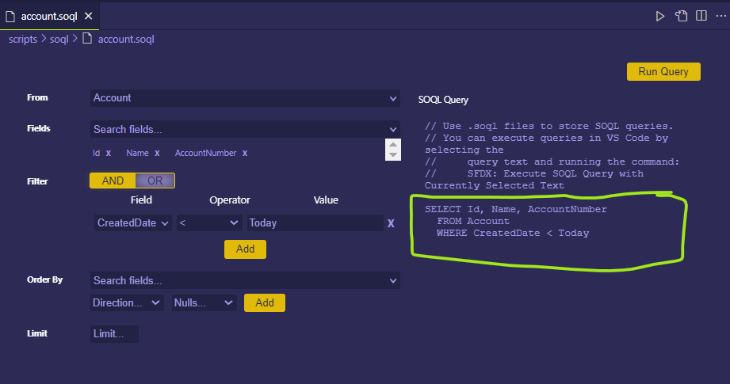
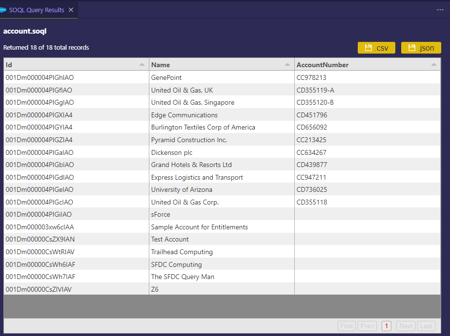
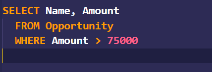
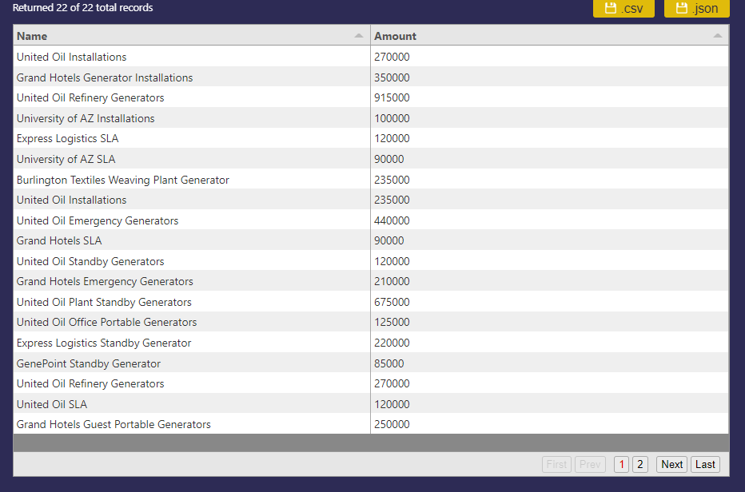
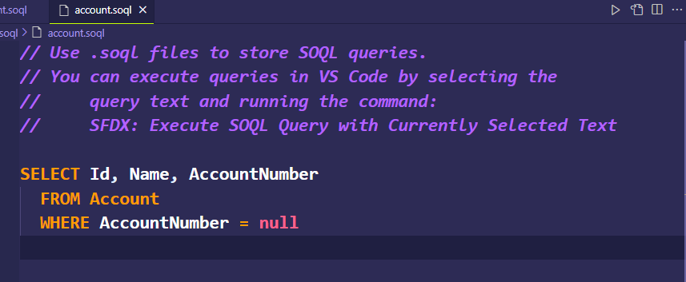
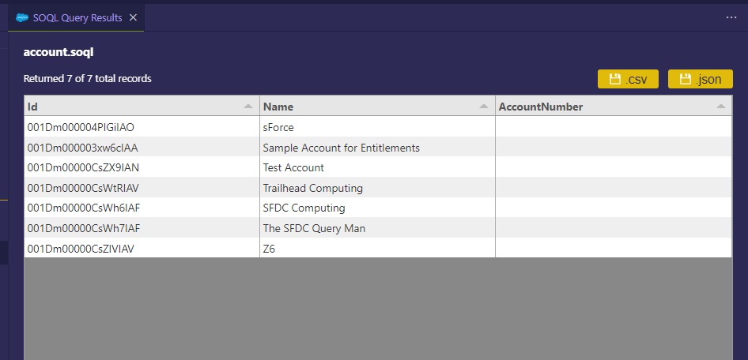

# VSCode Salesforce SOQL Practice

This Salesforce DX project was created to practice SOQL locally. The SOQL Files can be found in the **```scripts/soql```** directory. 


## **Images of Queries and Results**

#### Account
 <br>


#### Opportunity
<br>


#### Account Number Null
<br>


<br>

#### Dependencies
* VSCode
* SOQL
* Git and GitHub
* Bash Terminal
